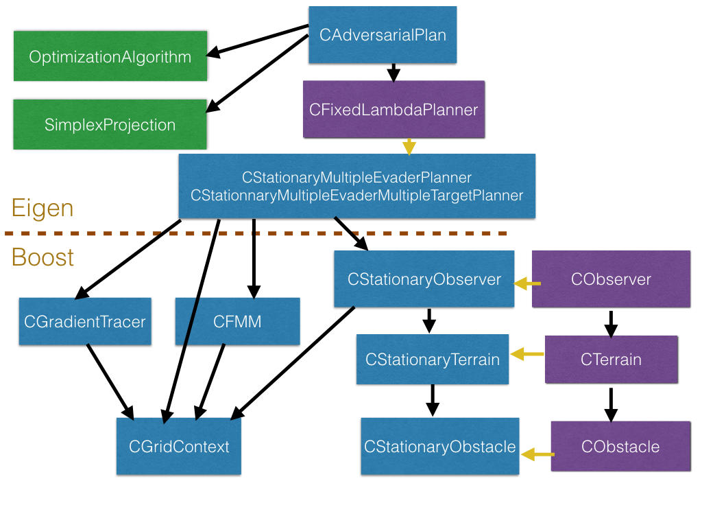

# License

This program is free software: you can redistribute it and/or modify it under the terms of the GNU General Public License as published by the Free Software Foundation, either version 3 of the License, or (at your option) any later version. This program is distributed in the hope that it will be useful, but WITHOUT ANY WARRANTY; without even the implied warranty of MERCHANTABILITY or FITNESS FOR A PARTICULAR PURPOSE.  See the GNU General Public License for more details.

You should have received a copy of the GNU General Public License along with this program.  If not, see <http://www.gnu.org/licenses/>.

--------------------------------------------
# Manuscript

The primary purpose in distributing this source code is to enable readers to reproduce the numerical  results reported in the manuscript "Surveillance-Evasion Games under Uncertainty" by M.A. Gilles and A. Vladimirsky. See [https://arxiv.org/abs/1812.10620](https://arxiv.org/abs/1812.10620).

--------------------------------------------
# Contributions

* Problem statement by A. Vladimirsky.
* The idea of the algorithm by A. Vladimirsky and M.A. Gilles.
* The numerical method development by M.A. Gilles and A. Vladimirsky.
* Implementation by M.A. Gilles.

--------------------------------------------
# Instructions

## Requirements
In order to run this code, two external C++ libraries are needed:
* [Boost](http://www.boost.org/) which is used for multidimensional array and the heap implementation
* [Eigen](http://eigen.tuxfamily.org/index.php?title=Main_Page) which is used for the linear algebra.

The code is run through a Makefile, and you will have to modify the [Makefile](https://github.com/eikonal-equation/Adversarial_Planning/blob/master/NashCode/Stationary_SEG%20/Makefile) to make sure both libraries are properly linked.

The code uses the C++14 standard, and can be compiled using both gcc and icpc.

The plotting scripts are in [jupyter notebooks](https://jupyter.org/).

## Running the code

Assuming the code the libraries are linked, you should be able to compile the code and run the test cases.

To compile, make sure you are in the folder /Stationary_SEG/ and run
`make`

Then figures 3,4,5,6,9,10,11 and 12 of the [manuscript](https://arxiv.org/abs/1812.10620) can be reproduced by running:

` make TEST=(INSERT FIG # HERE) run`

For example for figure 4 of the paper, run:

` make TEST=4 run`

## Visualizing output

You can look at the output by running the jupyter notebook in the python folder [here](https://github.com/eikonal-equation/Adversarial_Planning/blob/master/NashCode/python). For the test cases with a single evader (figures 3, 4, 5, 6, 9 and 10), use the file [FindNashSingleTarget](https://github.com/eikonal-equation/Adversarial_Planning/blob/master/NashCode/Stationary_SEG%20/python/PlotNashSingleTarget.ipynb), and for the test case with multiple evader (figures 11 and 12), use the file [FindNashMultipleTarget](https://github.com/eikonal-equation/Adversarial_Planning/blob/master/NashCode/Stationary_SEG%20/python/PlotNashMultipleTargets.ipynb).

In each of the files, you will have to change the name of the input file accordingly. If you have run the command `make TEST=4 run` then you need to set the name variable in the [FindNashSingleTarget](https://github.com/eikonal-equation/Adversarial_Planning/blob/master/NashCode/Stationary_SEG%20/python/PlotNashSingleTarget.ipynb) to FigureFour:
`name = FigureFour`

----------------------------------------
# Coding conventions

### Naming conventions
Some conventions:

* Class names start with a upper case `C`
* Names of argument of functions start with a lower case `a`
* Names of data member classes start with a lower case `f`
* Names of methods of classes start with a lower case

### Code Architecture
Below is a sketch of the code architecture.

* Purple boxes are abstract classes
* Blue boxes are regular classes
* Green boxes are not classes
* yellow arrow = parent &rarr; child class relationship
* black arrow = has a/ uses relationship

### Boost vs Eigen

The lower level part of the code includes how the grids are handled, the FMM solver and the path tracer. All of the work for the low level relies on the class boost::multi_array, which is a memory efficient implementation of multidimensional arrays.

The higher level part of the code includes the subgradient methods and diverse functions. It uses the Eigen library for the linear algebra.
